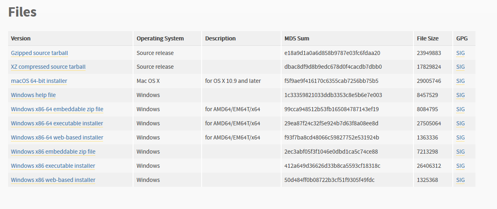

# weixin_checkin readme

## requires:
python  
itchat xlrd xlwt xlutils

## To run:
Set up the parameters in settings.py
double click run.bat

## To contribute
Plz upgrade this guidance and readme.md when you push uew code to the repository. And remember to generate the PDF version, before you commit to master.

# 以下向没有编程基础的使用者介绍如何使用此脚本
详细可见pdf版  

## 安装前先讲明脚本使用格式：

#### 时间：  
1. 脚本以早上六点为一天的分割界限。也就是说，从晚上开始汇报时到第二天六点之间的汇报信息，都会视为是今天的记录。
2. 在每天11pm到第二天6am，若收到了汇报信息，会自动发送提示信息

#### 接收条件：
脚本会检测所登陆的微信中，大于三人群聊中的所有交流信息。若符合格式（见下）并成功在excle中匹配，就会当作汇报信息，记录在表格中。  

一个技巧：因为脚本会检测所有的群聊，因此如果收集者错过了一些汇报信息，不需要重新手动登记，只需要将错过的记录重新转发到群聊中（不一定是原来的群聊），脚本就能重新接受这些汇报信息。转发的时候需要选择`逐条转发`。  
实际上，我们新开了一个群聊专以转发，里面只有三个人：日常忘记开脚本的收集者、脚本作者以及一位同学在其中，惨兮兮的不胜其扰。

#### 重要：汇报格式


1. 汇报仅汇报物院本班情况即可，不需要回复其他学院以及其他班级同学的回寝情况；（此条为建议，视情况而言）
   
2. 回复内容需要【严格】按照以下格式：  
   `[班级]+[宿舍楼]+[宿舍号]+[回寝情况]`  
   （此条为必须，除非你改了脚本）  
     

如18级使用脚本格式（下称前述例子）：

>1. 班级：请使用应物、严班、光一、光二四者之一，即全使用汉字；  
>2. 宿舍楼：请使用英文字母C(大小写都可以)，其后加上一位阿拉伯数字1或4；  
>3. 宿舍号：请使用三位阿拉伯数字；  
>4. 回寝情况：若无异常，请回复“全员归寝无异常”；若其他情况，则请使用[姓名]+[情况]进行汇报，如xxx回家、xxx有活动等。  
>5. 需要注意：1、各项间使用空格隔开；2、有其他情况时，请不要在情况说明中加入“其余齐”等不必要文字；3、汇报中请不要使用“我”等人称代词，应使用完整的姓名，并尽量不要用错字。

以上格式根据程序文件settings.py中的正则而定，后文有解释。

#### 目标文件
生成的目标文件名字为dormitory.xls，每一周脚本都会在这个文件中生成新的工作表，工作表名字是周数。此文件位置可在settings.py中进行设置。

## 第一步：环境搭建

## 安装python（windows）

1. 进入官网www.python.org，在downloads下选择windows，并在页面最下方Flies选择相对应的版本
  
其中，不建议下载embeddable内嵌版本。建议直接下载executable可执行版本。
例如：windows64位系统，选择`Windows x86-64 executable installer`下载即可。

2. 双击打开刚下载的可执行文件，显示出以下界面（可能稍微又不同，但总的来说是差不多的） 

注意：需要先把下面的`Add Python to PATH` 勾上，再点击安装。然后按照提示完成安装。

## 验证以及依赖包的安装（Windows）

1. 返回windows桌面，使用win+R调出运行窗口。在运行窗口中输入cmd，并回车。调出cmd窗口

2. 在cmd窗口中输入 `python -V`,若输出 python+<版本号> 则python安装无误。如图  
  
我装的是3.7.2。只要是3.6以上版本应该都没有问题

3. 安装此脚本的依赖包：在cmd窗口键入 `pip install itchat xlrd xlwt xlutils`并回车  
   出现安装进度条，等待安装完成即可。  
   注：若要检验此步安装是否正确，可以再重新pip install一次，观察输出内容。若全为"Requirement already satisfied..."则安装成功

4. 可以关闭cmd窗口了

5. 使用其他系统的话，使用不同方法调出命令行工具，然后依照以上步骤就可以了
   
## 脚本源码的安装以及试运行

1. 进入网站 <https://github.com/ForSeason/weixin_checkin> ，点击右侧绿色按钮，选择Download ZIP   
注：1)当然了，会使用git的话，直接git clone就更好了;   
2)此github账户即为源码作者账户

1. 解压zip(下称解压目录），文件夹内容如图  
     
   第一次双击run.bat,会在桌面创建一个dormitory.xls后退出；(如果没有成功创建的话，请看下文关于settings.py的设置)  
   第二次双击，若出现下图的窗口并弹出一个二维码，则以上步骤安装无误  
     
   第一次运行可能会卡在Initialization那，稍作等待几分钟即可  
注：  
1）试运行没成功没有关系，完成下面设置再试运行也可以
2）dormitory.xls就是自动登记表，如果不喜欢他自动生成在桌面，可以改的
3）出现的二维码是微信登陆的二维码，因此试运行时请保证网络连接

## 第二步：变量设置

## template.xls
template.xls 是一个用来存放模板信息的表格，应当用来存放住宿信息。脚本在每周会访问一次此模板以创建新的dormitory.xls。此模板应当放置在解压目录下。格式如下：  

|班级|宿舍楼|宿舍|宿舍长|周一|周二|周三|周四|周五|周六|周日|
|:-:|:-:|:-:|:-:|:-:|:-:|:-:|:-:|:-:|:-:|:-:|
|严班|C4|C4-101|黄XX||||||||
|应物|C1|C1-111|成XX||||||||
|...|...|...|...||||||||

务必按照以上格式，否则脚本可能匹配不成功。  
若没有此tempalte.xls

## settings.py

settings.py位于解压目录下（不是settings_win.py)，内部写入了脚本运行使用的常量，不建议经常更改。
打开方式：右键->Edit with IDLE->Edit with IDLE ...


1. self.path
   此变量表示dormitory.xls的路径。若试运行不成功，极有可能是此路径设置错误。将此路径改成自己希望脚本输出dormitory.xls的位置就可以了。  
   【注意】：此处路径必须统一使用斜杠(`/`)或双反斜杠(`\\`)。实际上大多数编程语言都是这样要求的。  
    
   如：
   ```python
   'C:\\Users\\User\\Desktop\\dormitory.xls'
   ```
   或
   ```python
   'C:/Users/User/Desktop/dormitory.xls'
   ```
   切勿：
   ```python
   'C:\Users\User\Desktop\dormitory.xls'
   ```
   若忽略此条会导致运行不成功，并极可能查200年查不出哪里出错的后果。 

2. self.week()  
   `self.weed()`是用以记录开学周是今年的第几周的。如2018年下学期开学周为全年第7周，则讲此行改写成 `self.weed() = 7`即可。  
   他的作用是用来计算当前学期周的，脚本使用`本周全年周` 减去 开学全年周即`self.weed()` 来计算 `本周学期周`。  
   因此，不知道如何计算`self.weed()`的话，可以根据dormitory.xls中输出的周数进行调整。
   
3. self.pattern1  
   这个参数是用正则表达式来匹配字符串的前三部分。简单来说，正则是通过一定规则、并且按照顺序来匹配字符串格式的。  
   具体正则教程可百度关键词python正则  

   需要注意：以下匹配忽略字符串中全部空格

   如前述例子：

   ```python
    self.pattern1 = '(光一|光二|应物|严班)([Cc][14])(\d{3})'
    ```
   其中，第一个括号：
    ```python
    '(光一|光二|应物|严班)'
    ```
    匹配班级。若字符串前两个汉字为“光一”“光二”“应物”“严班”中的两个，则进入下步匹配，否则此字符串不当作汇报字符串。  
    此处应写入各班简称，并用`|`连接，表示或。  
      
    第二个括号：
    ```python
    '([Cc][14])'
    ```
    匹配宿舍楼。若字符串后续两个字符，第一个为`C`或`c`，第二个为`1`或`4`，则匹配成功。
    此处应写入宿舍楼编号。

    第三个括号：  
    匹配寝室号。`\d{3}`意思是匹配三个数字。  
    此处保留不改即可。

若以上皆匹配成功，字符串所剩字符将用作以下匹配；否则此字符匹配不成功被忽略。

4. self.pattern2
   此处写入的是情况匹配。若所剩字符符合此正则，记录表中将记录为`√`；否则则被认为特殊情况，所剩字符将完整复制到dormitory.xls中

## 第三步：运行

完成以上设置并保存后，双击run.bat，会出现试运行中情况并弹出二维码。扫描二维码并登陆微信，脚本即运行。
